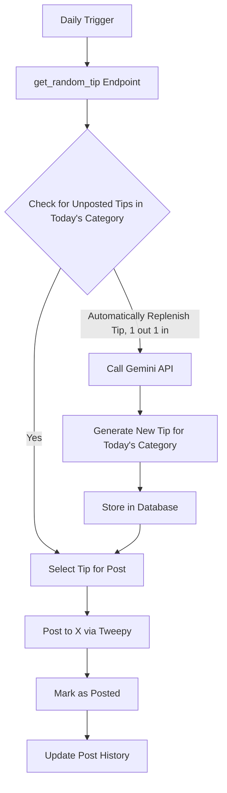

# FastAPI X Bot 🤖

An automated Twitter/X bot that posts daily tech tips using FastAPI and AI. Deployed on Render with automatic content generation and posting via Google's Gemini API and Tweepy.

## How It Works

The main endpoint `get_random_tip` handles the entire automation flow, when it is called, it looks at today's date and selects a category, every day of the week is assigned a category and this is then used to select a category from the categories table based on its id. 

Once a **category** is selected, it is then used as an argument for both our **Gemini** prompt, and our tip selection logic. We look at the tips table to tips in today's category that has not been posted and extract them. 

A tip is randomly selected, passed onto **Twitter** using Tweepy, and then marked as posted. At the same time, a new tip for the same category is generated and added to our tips table to ensure we always have a available tips:



## Tech Stack

**Backend:**
- **FastAPI** - Web framework and API
- **SQLAlchemy** - Database ORM
- **PostgreSQL** - Database
- **Pydantic** - Data validation

**AI & Automation:**
- **Google Gemini API** - AI tip generation
- **Tweepy** - Twitter/X API integration
- **Render** - Cloud deployment
- **Cron jobs** - Scheduled posting

## Features

- **Automated posting** - Daily tech tips without manual intervention
- **AI content generation** - New tips created when supply runs low
- **Duplicate prevention** - Tracks posted tips to avoid repeats
- **Category rotation** - Ensures diverse content across tech topics
- **Self-sustaining pipeline** - Maintains content supply automatically

## API Endpoints

| Method | Endpoint | Description |
|--------|----------|-------------|
| `GET` | `/` | Health check |
| `GET` | `/API/get_random_tip` | **Main automation endpoint** - selects tip, generates new content if needed, posts to X |
| `GET` | `/API/get_all_tips` | Get all tech tips |
| `POST` | `/API/add_new_tip` | Create a new tech tip | Generate Tips on Demand
| `DELETE` | `/API/delete_tips/{tip_id}` | Delete a tip by ID | If ever needed

## Quick Start

### Prerequisites
- Python 3.8+
- PostgreSQL
- pip

### Setup

1. **Clone and setup environment**
   ```bash
   git clone <your-repo-url>
   cd FastAPI-X-Bot
   python -m venv venv
   source venv/bin/activate  # Windows: venv\Scripts\activate
   pip install -r requirements.txt
   ```

2. **Environment variables (.env file)**
   ```bash
   GEMINI_KEY=your_gemini_api_key_here
   TWITTER_AUTH_HEADER=your_twitter_auth_header
   TWITTER_COOKIE=your_twitter_cookie
   DATABASE_URL=your_postgresql_url
   ```

3. **Initialize database and run**
   ```bash
   python setup_db.py
   cd app
   uvicorn main:app --reload
   ```

4. **Access API**
   - API: http://localhost:8000
   - Docs: http://localhost:8000/docs

## Database Schema

- **`categories`** - Tech tip categories (Python, JavaScript, DevOps, etc.)
- **`tips`** - Individual tech tips with content and metadata
- **`posted_tips`** - Posting history and duplicate prevention

## Deployment

Currently deployed on **Render**, and a cron-job every day to trigger the get_random_tip endpoint. 

## Contributing
This is a personal portfolio project, but if you'd like you can:

- Report bugs or suggest features
- Submit pull requests
- Help improve documentation

---